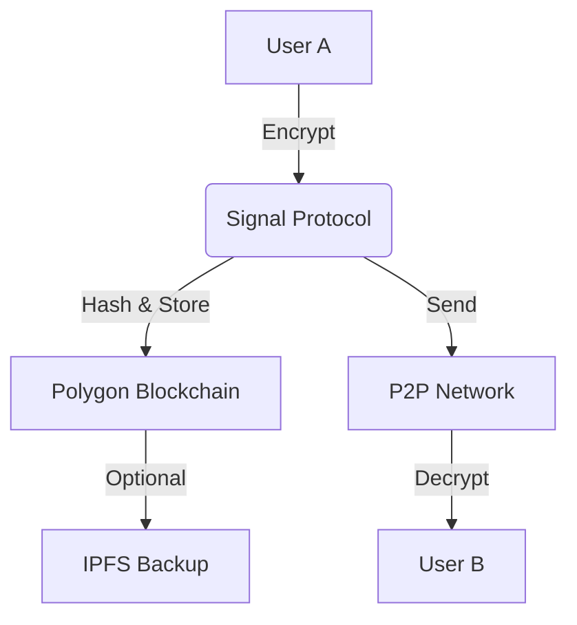

# ChatChain  
**The Messenger Where Groups Govern Themselves**  

### 💬 **WhatsApp Meets Blockchain**  
ChatChain is a secure messaging app with a revolutionary twist: **decentralized group governance**. Enjoy real-time P2P chats with blockchain-verified transparency, where every member has a voice in group decisions.  

---

## Key Features  

### 🏛️ **DAO-Powered Group Chats**  
**No More Admin Tyranny** – Groups run democratically:  
- **Add/Remove Members** via voting (e.g., "Should we add Bob?")  
- **Change Group Settings** with proposals (e.g., "Set 24h vote duration")  
- **Transparent Voting** recorded on Polygon blockchain  
- **Custom Rules** per group (quorums, approval thresholds)  

**Example Workflow:**  
1. Alice proposes adding Bob to "Family Group"  
2. Members vote via chat buttons (✅/❌) within 24h  
3. Smart contract auto-adds Bob if 60% vote "Yes"  

### 🔒 **Military-Grade Security**  
- **End-to-End Encryption** (Signal Protocol)  
- **Biometric Wallet Login** – No passwords, just your face/fingerprint  
- **Blockchain-Verified Integrity** – Every message hash stored on Polygon  
- **Optional IPFS Backup** – Encrypted and decentralized  

### ⚡ **Real-Time Hybrid Messaging**  

1. Messages encrypted **before leaving your device**  
2. Hashes stored on-chain for **tamper-proof verification**  
3. Delivered via **blazing-fast P2P/WebSocket**  

---

## 🌍 **Why ChatChain?**  
| Traditional Apps | ChatChain |  
|-----------------|-----------|  
| ❌ Admins have absolute power | ✅ Democratic group governance |  
| ❌ Closed-source encryption | ✅ Proven Signal Protocol + blockchain checks |  
| ❌ No audit trails | ✅ Every vote/message hash recorded on Polygon |  

**Perfect for:**  
- Families deciding on new members  
- DAOs coordinating in real-time  
- Communities with transparent governance  

---

## License  
MIT License - Free to use, modify, and distribute.  

**Ready to democratize your chats?** [Get Started](#)  

--- 

